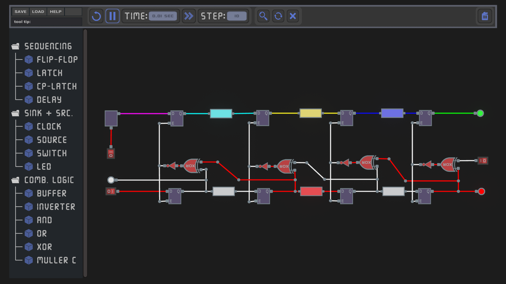

# Pipeline Simulation Tool
This simulation tool is made with Unity and aims at visualizing the operation principles both synchronous and asynchronous pipeline architectures, providing a more intuitive understanding of the topic. Similar to other available logic simulators, the tool allows to build digital circuits from scratch by placing and connecting different components. The advantage of this tool is, that it can also simulate the timing behaviour of the circuits, which is a key aspect when it comes to pipelining.

The user can enter important timing parameters of components, such as propagation delays, setup and hold times, clock period, etc. and see how these parameters affect the circuits overall behaviour and which timing constraints need to be adhered, for the design to work as intended. 

When dealing with pipelines where there are multiple instructions/tokens in the hardware at the same time, it is also important to distinguish the different tokens. 

