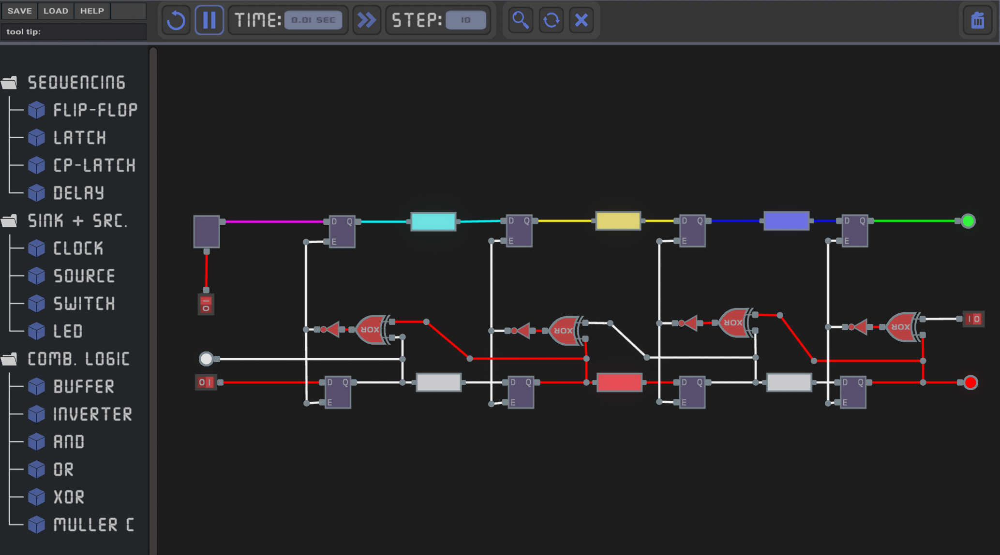

# Pipeline Simulation Tool
(Try it at: https://stefmeff.github.io/PipSim_Web/)

This simulation tool is made as part of a bachelors thesis in computer engineering at TU Wien. It aims at visualizing the operation principles of both synchronous and asynchronous pipeline architectures, providing a more intuitive understanding of the topic. Similar to other available logic simulators, the tool allows to build digital circuits from scratch by placing and connecting different components. One of the advantages of this tool is, that it can also simulate the timing behaviour of the circuits, which is a key aspect when it comes to pipelining.

The user can enter important timing parameters of components, such as propagation delays, setup and hold times, clock period, etc. and see how these parameters affect the circuits overall behaviour and which timing constraints need to be adhered, for the design to work as intended. By coloring the signals belonging to different data tokens, the user can easily distinguish and track the propagation of the data that travels through a pipeline. The impelemented delay visualization for logic gates (see figure below) is not only useful for conventional pipelines but even allows the visualization of wave-pipelined circuits.

The timing parameters of the components are all relative to the time unit entered in the top menu. This allows the user to speed up or slow down the simulation. The user can also step through the simulation with discrete time steps, allowing more control of the propagation of time. The folder "ProjectTemplates" includes some examplary projects, which can be opened within the application. The pre-built pipeline architectures include classical synchronous approaches such as flip-flop and latch based pipelines, that are driven by a global clock and also asynchronous approaches such as the Muller pipeline, Micropipelines and the Mousetrap pipeline, which operate via handshake signals. Links opening the individual pipeline projects in the web-application are listed below.

# Synchronous Pipelines:
* [Flip-Flop Pipeline](https://stefmeff.github.io/PipSim_Web/?file=https://raw.githubusercontent.com/Stefmeff/PipelineSim/refs/heads/main/ProjectTemplates/SyncPipelines/FlipFlopPipeline.pip)
* [2 Phase Transparent Latch Pipeline](https://stefmeff.github.io/PipSim_Web/?file=https://raw.githubusercontent.com/Stefmeff/PipelineSim/refs/heads/main/ProjectTemplates/SyncPipelines/2PhaseLatchPipeline.pip)
* [Pulsed Latch Pipeline](https://stefmeff.github.io/PipSim_Web/?file=https://raw.githubusercontent.com/Stefmeff/PipelineSim/refs/heads/main/ProjectTemplates/SyncPipelines/PulsedLatchPipeline.pip)

# Asynchronous Pipelines:
* [Muller Pipeline](https://stefmeff.github.io/PipSim_Web/?file=https://raw.githubusercontent.com/Stefmeff/PipelineSim/refs/heads/main/ProjectTemplates/AysncPipelines/MullerPipeline.pip)
* [Latch-Based Muller Pipeline](https://stefmeff.github.io/PipSim_Web/?file=https://raw.githubusercontent.com/Stefmeff/PipelineSim/refs/heads/main/ProjectTemplates/AysncPipelines/4PhaseBundledData.pip)
* [Micropipelines](https://stefmeff.github.io/PipSim_Web/?file=https://raw.githubusercontent.com/Stefmeff/PipelineSim/refs/heads/main/ProjectTemplates/AysncPipelines/Micropipeline.pip)
* [Mousetrap](https://stefmeff.github.io/PipSim_Web/?file=https://raw.githubusercontent.com/Stefmeff/PipelineSim/refs/heads/main/ProjectTemplates/AysncPipelines/Mousetrap.pip)

The tool was implemented in Unity because of its ability to easily create user interfaces and distribute the application
across multiple platforms, including Linux, Windows, and WebGL. If you want to test out the application, please go to the "Versions" folder for latest updates. For implementation details, please go to the "Assets/Scripts" folder.

