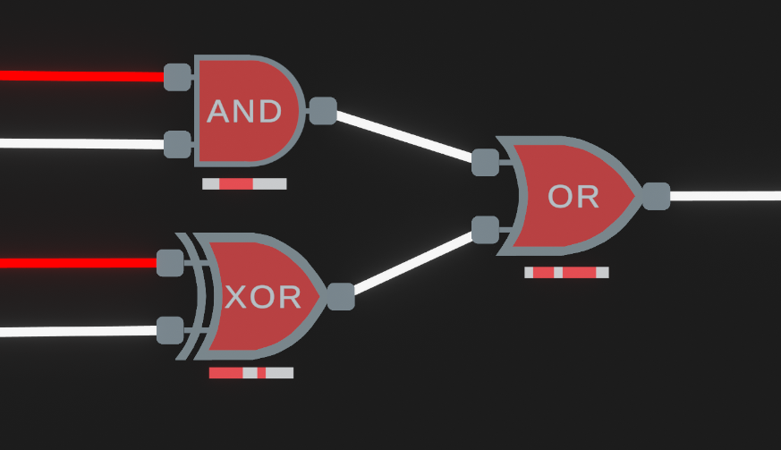

# Pipeline Simulation Tool
This simulation tool is made as part of a bachelors thesis in computer engineering at TU Wien. It aims at visualizing the operation principles of both synchronous and asynchronous pipeline architectures, providing a more intuitive understanding of the topic. Similar to other available logic simulators, the tool allows to build digital circuits from scratch by placing and connecting different components. The advantage of this tool is, that it can also simulate the timing behaviour of the circuits, which is a key aspect when it comes to pipelining.

The user can enter important timing parameters of components, such as propagation delays, setup and hold times, clock period, etc. and see how these parameters affect the circuits overall behaviour and which timing constraints need to be adhered, for the design to work as intended. By coloring the signals belonging to different data tokens, the user can easily distinguish and track the propagation of the data that travels through a pipeline. The impelemented delay visualization for logic gates (see figure below) is not only useful for conventional pipelines but even allows the visualization of wave-pipelined circuits.

The timing parameters of the components are all relative to the time unit entered in the top menu. This allows the user to speed up or slow down the simulation. The user can also step through the simulation with discrete time steps, allowing more controll of the timing simulation.

